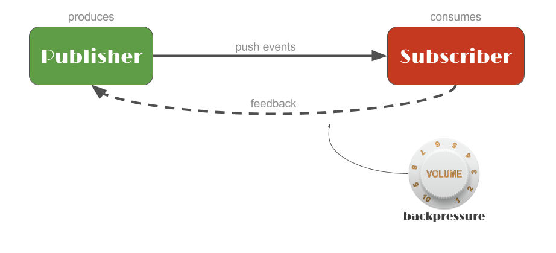
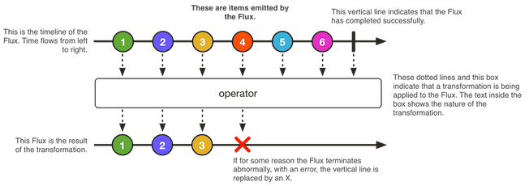
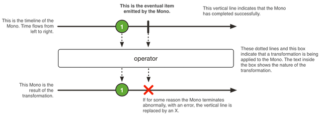

[↑ Back to Project Reactor Notes](Contents.md)  
[← Home](/README.md)

# Intro to Reactor and Reactive Programming

A hands on intro course developed by Project Reactor  
🔗 [Link to course](https://tech.io/playgrounds/929/reactive-programming-with-reactor-3/Intro)

## Contents

[Introduction to Reactive Programming](#introduction-to-reactive-programming)  
[Flux](#flux)  
[Mono](#mono)  
[StepVerifier](#stepverifier)  
[Transform](#transform)  
[Merge](#merge)  
[Request](#request)  
[Error](#error)  
[Adapt](#adapt)  

### 📝 Note: 

Each topic has a set of exercises, if utilizing the course they will appear on each topics page. If you are utilizing just the notebook here are links to the GitHub repo conatining the exercises and solutions. 

🔗 [Intro to Reactor Topics Exercises](https://github.com/reactor/lite-rx-api-hands-on/tree/techio_course/src/main/java/io/pivotal/literx)  
🔗 [Intro to Reactor Topics Solutions](https://github.com/reactor/lite-rx-api-hands-on/tree/solution/src/main/java/io/pivotal/literx)  

---

## Introduction to Reactive Programming

Reactor 3 is a library built around the [Reactive Streams](https://www.reactive-streams.org/) specification

The goal behind Reactive Programming is to be fully asynchronous and non-blocking in a more readable and maintainable manner
than Callback based APIs adn Future types

### Reactive Stream Sequence

1. Publisher (the source) produces data
   - Does nothing until the Subscriber has subscribed (registered)
2. Subscriber consumes the data
   - Data is pushed to the Subscriber via the Publisher



Reactor adds **operators** to the Reactive Stream Sequence. **Operators** are chained together to describe what processing
to apply at each stage to the data.

Apply an **operator** returns a new intermediate Publisher
- Subscriber to the operator upstream 
- Publisher to the operator downstream

The final form of the data ends up in the final Subscriber that defines what to do from a user perspective.

Needed for creating a Reactive Stream Publisher or Subscriber
- Code must comply with the spec and pass TCK
  - [TCK = Technology Compatibility Kit](https://en.wikipedia.org/wiki/Technology_Compatibility_Kit)
- Favor using an existing library like Reactor 3, RxJava, Akka Streams, Vert.x or Ratpack

## Flux 

**Flux** is a Reactive Streams Publisher that can be used to generate, transform and orchestrate Flux sequences via **operators**

Flux can emit 0 to _n_ elements via `onNext`events  

- Completes via `onComplete` terminal events
- Errors via `onError`terminal events

**Note:** if no terminal event is triggered, the Flux is infinite



### Flux Example

```java
Flux.fromIterable(getSomeLongList())
    .delayElements(Duration.ofMillis(100))
    .doOnNext(serviceA::someObserver)
    .map(d -> d * 2)
    .take(3)
    .onErrorResumeWith(errorHandler::fallback)
    .doAfterTerminate(serviceM::incrementTerminate)
    .subscribe(System.out::println);
```

## Mono

**Mono** is a Reactive Streams Publisher that can be used to generate, transform and orchestrate Mono sequences via **operators**

It is a specialization of **Flux** that can emit **at most 1 element**
- Valued (complete with element)
- Empty (complete without element)
- Failed (error)



`Mono<Void>` is something that can be utilized when only the completion signal is interesting

### Mono Example

```java
Mono.firstWithValue(
        Mono.just(1).map(integer -> "foo" + integer),
        Mono.delay(Duration.ofMillis(100)).thenReturn("bar")
    )
    .subscribe(System.out::println);
```

## StepVerifier

A `StepVerifier` comes from the `reactor-test` artifact and is capable of subscribing to any Publisher and assert expectations.
This is something that would be utilized with **unit testing**.

An instance of `StepVerifier` can be created via `.create()`, configured via a [DSL](https://docs.spring.io/spring-integration/docs/5.1.0.M1/reference/html/java-dsl.html)
for setting expectations, and finish with a single terminal expectation (completion, error, cancellation...)

When utilizing `StepVerifier` some form of `verify()` method **needs to be used**. If it is not used, the `StepVerifier` won't
subscribe to the sequence and nothing will be asserted.

### StepVerifier Example

```java
StepVerifier.create(T<Publisher>).{expectations...}.verify()
```

## Transform

Reactor has several operators that can be used to transform data. This means that when the subscriber receives data, it
then can take that data and transform it into something else. 

#### 🔗 [Transform Overview](https://projectreactor.io/docs/core/release/reference/#which.values)

## Merge

Merging sequences is utilized when listening for values from multiple Publishers, merging the data retrieved and returning
a single Flux. 

**Note:** Examples of ways to merge data from multiple publishers can be found [using the link above](#🔗-transform-overview)
and looking for the bullet point stating `"I want to combine publishers..."` 

## Request 

**Backpressure** a feedback mechanism that allows a **Subscriber** to signal to its **Publisher** how much data it is prepared to process, limiting the rate at which the **Publisher** produces data. 

**AKA:** A way that the **Subscriber** can inform the **Publisher** how much data it can consume

Backpressure is configured at the **Subscription** level.

`subscribe()` - creates a **Subscription**  
`cancel()` - cancels the flow of data  
`request(long)` - tunes demand of data

**Request Example:** `request(Long.MAX_VALUE)` - **Publisher** will emit data at its fastest pace due to request demand is essentially unbound. 

🔗 [Backpressure Overview](https://projectreactor.io/docs/core/release/reference/#reactive.backpressure)  
🔗 [Subscribe Method Examples](https://projectreactor.io/docs/core/release/reference/#_subscribe_method_examples)  
🔗 [Peeking into a Sequence](https://projectreactor.io/docs/core/release/reference/#which.peeking)

## Error

Reactor ships with several tools that can be used to handle, recover from and even retry a new **Subscription**. The main goal with handling errors still stands, catch them and handle them gracefully.

🔗 [Error Handling Operators Overview](https://projectreactor.io/docs/core/release/reference/#_error_handling_operators)  
🔗 [Handling Errors Overview](https://projectreactor.io/docs/core/release/reference/#_error_handling_operators)

## Adapt

Reactor 3 has the ability to interact with [RxJava3](https://reactivex.io/intro.html) without having to utilize a library inbetween to translate. This can help with projects that are utilizing RxJava3 to leverage Reactor 3 with less complexity and re-work. 

### `Flux` ↔️ `Flowable`

```java
	// Adapt Flux to RxJava Flowable
	Flowable<User> fromFluxToFlowable(Flux<User> flux) {
		return Flowable.fromPublisher(flux);
	}

	// Adapt RxJava Flowable to Flux
	Flux<User> fromFlowableToFlux(Flowable<User> flowable) {
		return Flux.from(flowable);
	}
```

🔗 [`Flux.from()`](https://projectreactor.io/docs/core/release/api/reactor/core/publisher/Flux.html#from-org.reactivestreams.Publisher-)  
🔗 [`Flowable.fromPublisher()`](https://reactivex.io/RxJava/3.x/javadoc/io/reactivex/rxjava3/core/Flowable.html#fromPublisher-org.reactivestreams.Publisher-)

### `Flux` ↔️ `Flowable` ↔️ `Observable`

```java
	// Adapt Flux to RxJava Observable
	Observable<User> fromFluxToObservable(Flux<User> flux) {
		return Flowable.fromPublisher(flux).toObservable();
	}

	// Adapt RxJava Observable to Flux
	Flux<User> fromObservableToFlux(Observable<User> observable) {
		return Flux.from(observable.toFlowable(BackpressureStrategy.BUFFER));
	}
```

🔗 [`Observable`]()  
🔗 [`Flowable.toObservable()`](https://reactivex.io/RxJava/3.x/javadoc/io/reactivex/rxjava3/core/Flowable.html#toObservable--)  
🔗 [`Observable.toFlowable()`](https://reactivex.io/RxJava/3.x/javadoc/io/reactivex/rxjava3/core/Observable.html#toFlowable-io.reactivex.rxjava3.core.BackpressureStrategy-)  
🔗 [BackpressureStrategy](http://reactivex.io/RxJava/3.x/javadoc/io/reactivex/rxjava3/core/BackpressureStrategy.html)

### `Mono` ↔️ `Single`

```java
	// Adapt Mono to RxJava Single
	Single<User> fromMonoToSingle(Mono<User> mono) {
		return Single.fromPublisher(mono);
	}

	// Adapt RxJava Single to Mono
	Mono<User> fromSingleToMono(Single<User> single) {
		return Mono.from(Flowable.fromSingle(single));
	}
```

🔗 [`Single`](https://reactivex.io/RxJava/3.x/javadoc/io/reactivex/rxjava3/core/Single.html)  
🔗 [`Mono.from()`](https://reactivex.io/RxJava/3.x/javadoc/io/reactivex/rxjava3/core/Single.html)  
🔗 [`Flowable.fromSingle()`](https://reactivex.io/RxJava/3.x/javadoc/io/reactivex/rxjava3/core/Flowable.html#fromSingle-io.reactivex.rxjava3.core.SingleSource-)  
🔗 [`Single.fromPublisher()`](https://reactivex.io/RxJava/3.x/javadoc/io/reactivex/rxjava3/core/Single.html#fromPublisher-org.reactivestreams.Publisher-) 

### `Mono` ↔️ `CompletableFuture`

```java
	// Adapt Mono to Java 8+ CompletableFuture
	CompletableFuture<User> fromMonoToCompletableFuture(Mono<User> mono) {
		return mono.toFuture();
	}

	// Adapt Java 8+ CompletableFuture to Mono
	Mono<User> fromCompletableFutureToMono(CompletableFuture<User> future) {
		return Mono.fromFuture(future);
	}
```