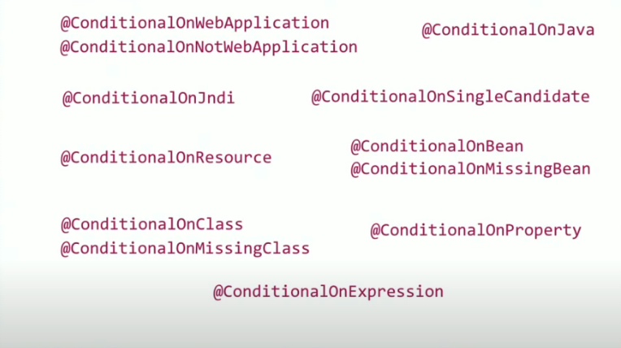
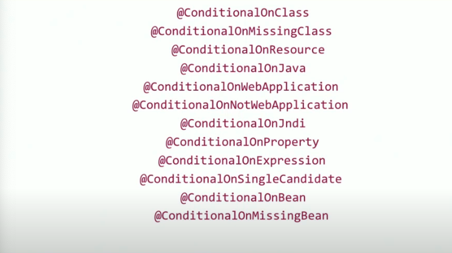
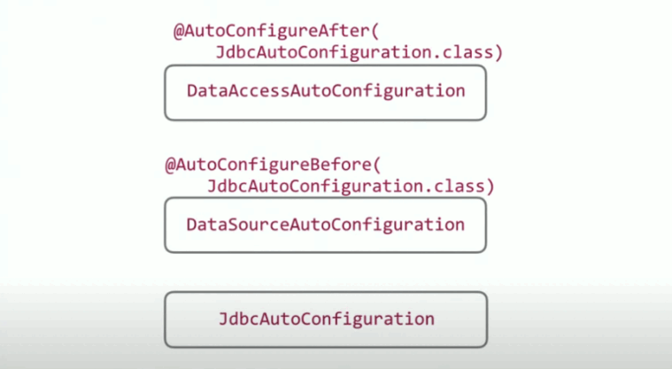

[↑ Back to Spring Boot Notes](Contents.md)  
[← Home](/README.md)

# Under The Covers of Spring Boot

## `@SpringBootApplication` 

Combines **three annotations** into **one** - however, not mandatory to use if you don't want to utilize all three annotation in
your project. These tend to be the most frequently utilized to configure a Spring Boot project. There's no "hardcoded" path
when configuring a Spring Boot project.

- `@SpringBootConfiguration`
- `@ComponentScan`
- `@EnableAutoConfiguration`

## `@ComponentScan`

Scans for beans and components within a particular package.

If added to a class/package in the root of the project it will be able to scan and detect all beans within the project.  
If added to a class/package "deeper" into the project it will not scan beans and components that are outside that package.

- Provide a package to the annotation 
- Current package where you declared it

## `@Component`

A generalized way of adding and annotation to a component of your application.  
There are a few more specialized ways to annotate a component. Those specialized annotations can be used for declarative
purposes for the dedicated stereotype, or have additional
attributes that are treated differently by Spring Boot.

Examples of specialized component annotations

- `@Service`
- `@RestController`
- `@Controller`
- `@Repository`
- `@Configuration`
- `@Bean`

## `@ComponentScan` & `@EnableAutoConfiguration`

`@ComponentScan` Scans and gathers beans and components that are **user configured**  
`@EnableAutoConfiguration` Scans and gathers beans and components that are **configured by Spring Boot**  
Both of these scans take place in different stages 

1. User Configuration - via `@ComponentScan` and `@Configuraiton`
2. Auto Configuration - via `@EnableAutoConfiguration`

This can result in adding additional configurations or overriding a user configuration.  
Auto Configuration can be along the lines of an all or nothing scenario, but a user configuration can take extra time to 
complete the entire configuration process. At times, it works out better to pick and choose what you'd want to configure
and let Spring Boot take care of the rest.

A way to pick and choose what part of the auto configuration is creating environment variables in the `application.properties.yaml` file

## Configuration Processor

This is a dependency that can be added to a project that will allow your custom configurations to have IDE suggestions. 
This dependency is only needed locally and is utilized for compilation not run-time. Adding documentation via comments above
fields will be added to the metadata for IDE suggestions.

## Conditional Configurations

`@ConditionalOnMissingBean` - process this configuration when the assigned bean type is missing or not found  
`@ConditionalOnClass` - process this only on this assigned class or class path

and more...

## `@EnableAutoConfiguraiton` Flow

1. Sees all configuration that are present in the project
2. Checks to see if there are configuration conditions to be met 
   1. **If met** - configuration will be applied
   2. **If not met** - configuration is skipped
      1. If there are other conditions - They will be skipped due to one not being met
3. Gathers all configurations that have met conditions or configurations that do not have conditions
4. Check functions within classes to see if any conditions are set and if they are met

⬇️ This is the order that the conditional annotations are checked - which is least → most "expensive" ⬇️

## Setting The Order of Auto Configurations

There are annotations available within Spring Boot which allows you to state when the auto configuration should take place

- `@AutoConfigureBefore`
- `@AutoConfigureAfter`

Demonstration of establishing order of configuration and chain of creating beans 

