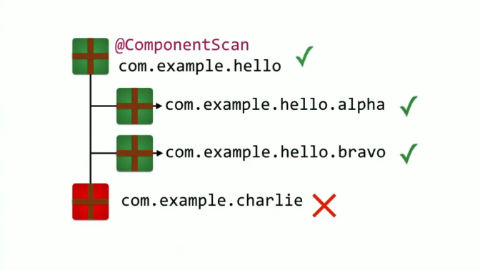
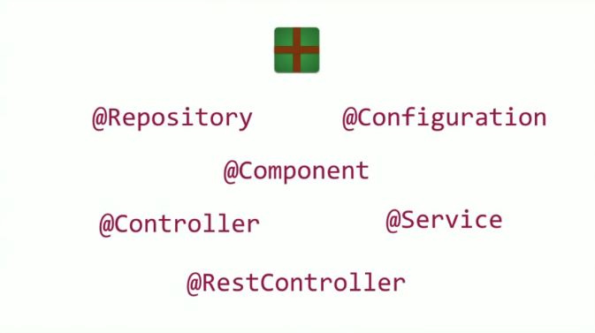
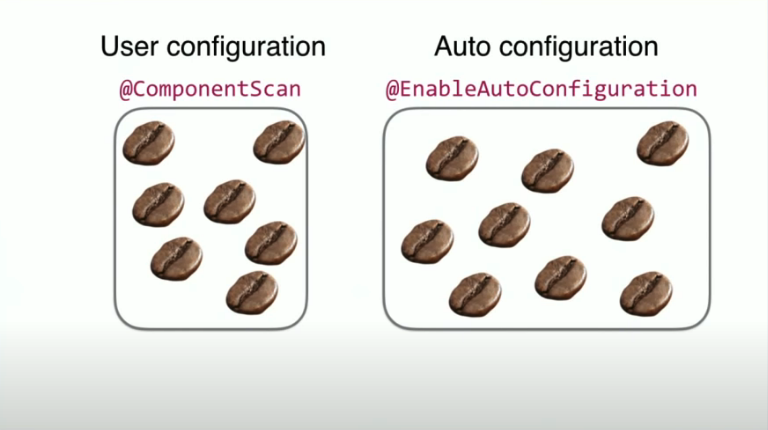

[↑ Back to Spring Boot Notes](Contents.md)  
[← Home](/README.md)

# Under The Covers of Spring Boot

## Basic Spring Boot Application

### `@SpringBootApplication` 

Combines **three annotations** into **one** - however, not mandatory to use if you don't want to utilize all three annotation in
your project. These tend to be the most frequently utilized to configure a Spring Boot project. There's no "hardcoded" path
when configuring a Spring Boot project.

- `@SpringBootConfiguration`
- `@ComponentScan`
- `@EnableAutoConfiguration`

### `@ComponentScan`

Scans for beans and components within a particular package.

If added to a class/package in the root of the project it will be able to scan and detect all beans within the project.  
If added to a class/package "deeper" into the project it will not scan beans and components that are outside that package.

- Provide a package to the annotation 
- Current package where you declared it

### `@Component`

A generalized way of adding and annotation to a component of your application.  
There are a few more specialized ways to annotate a component. Those specialized annotations can be used for declarative
purposes for the dedicated stereotype, or have additional
attributes that are treated differently by Spring Boot.

Examples of specialized component annotations

- `@Service`
- `@RestController`
- `@Controller`
- `@Repository`
- `@Configuration`
- `@Bean`

### `@ComponentScan` vs `@EnableAutoConfiguration`

`@ComponentScan` Scans and gathers beans and components that are **user configured**  
`@EnableAutoConfiguration` Scans and gathers beans and components that are **configured by Spring Boot**  
Both of these scans take place in different stages 

1. User Configuration - via `@ComponentScan` and `@Configuraiton`
2. Autoconfiguration - via `@EnableAutoConfiguration`

This can result in adding additional configurations or overriding a user configuration.  
Autoconfiguration can be along the lines of an all or nothing scenario, but a user configuration can take extra time to 
complete the entire configuration process. At times, it works out better to pick and choose what you'd want to configure
and let Spring Boot take care of the rest.

A way to pick and choose what part of the autoconfiguration is creating environment variables in the `application.properties.yaml` file

